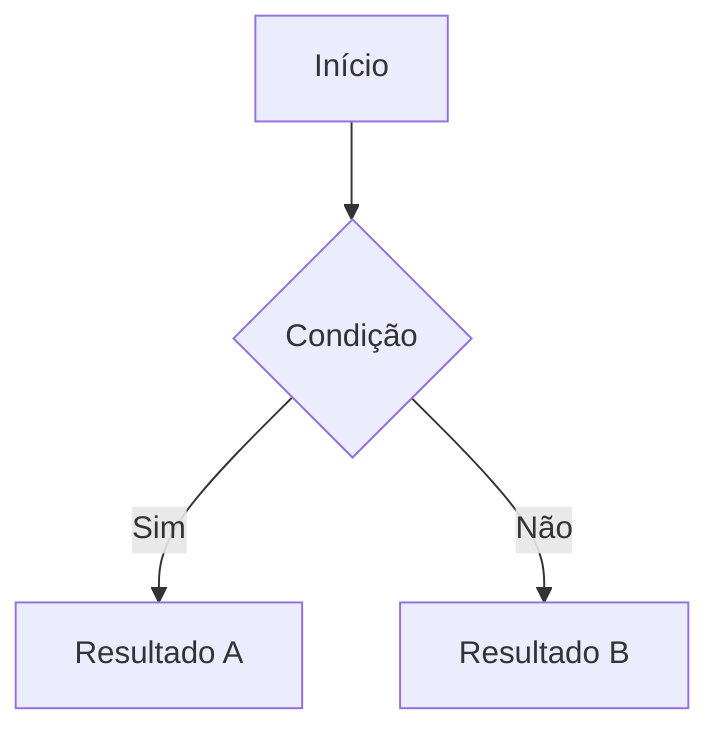

# DocViewer

Sistema interno de documentação e base de conhecimento da Chiptronic, desenvolvido para centralizar e padronizar a documentação técnica dos projetos. O sistema utiliza arquivos Markdown como fonte de conteúdo, com suporte a funcionalidades avançadas como renderização de diagramas, blocos interativos de API e upload de documentos diretamente pela interface.

> **Status:** em desenvolvimento ativo — funcionalidades podem mudar entre versões.

---

## Sumário

- [Requisitos](#requisitos)
- [Instalação e execução](#instalação-e-execução)
- [Estrutura do projeto](#estrutura-do-projeto)
- [Funcionalidades](#funcionalidades)
  - [Visualização de Markdown](#visualização-de-markdown)
  - [Blocos de código](#blocos-de-código)
  - [Diagramas com Mermaid](#diagramas-com-mermaid)
  - [Bloco interativo de API](#bloco-interativo-de-api)
  - [Sistema de âncoras](#sistema-de-âncoras)
  - [Upload de documentos](#upload-de-documentos)
  - [Remoção de documentos](#remoção-de-documentos)
- [Adicionando documentos manualmente](#adicionando-documentos-manualmente)
- [Licença](#licença)

---

## Requisitos

- [Node.js](https://nodejs.org/) v18 ou superior
- npm v9 ou superior

---

## Instalação e execução

````bash
# 1. Clone o repositório
git clone https://github.com/nathanchiptronic/docViewer.git
cd docViewer

# 2. Instale as dependências
npm install

# 3. Inicie o servidor de desenvolvimento
npm run dev
````

O sistema estará disponível em `http://localhost:5173`.

> **Atenção:** o DocViewer foi desenvolvido para rodar localmente. Não há suporte a deploy em produção nesta versão.

---

## Estrutura do projeto

```
docViewer/
├── public/
│ ├── docs/ # Arquivos .md de documentação
│ └── .generated/
│ └── documentsIndex.json # Índice gerado automaticamente
├── server/
│ └── generateDocumentsIndex.js # Script de indexação dos documentos
├── src/
│ ├── components/
│ │ ├── Markdowns/ # Componentes de renderização de Markdown
│ │ ├── Sidebar/ # Sidebar e diálogo de remoção
│ │ ├── UploadDocument/ # Componentes de upload
│ │ └── shared/ # Componentes reutilizáveis (Header, Toast, etc.)
│ ├── layouts/ # Layout principal da aplicação
│ ├── pages/ # Páginas (Home, Document)
│ ├── router/ # Configuração de rotas e loaders
│ └── utils/
│ └── documentsApi.js # Funções de comunicação com a API interna
├── vite.config.js # Configuração do Vite + plugin de API interna
└── home.md # Conteúdo da página inicial
```

---

## Funcionalidades

### Visualização de Markdown

Todos os arquivos `.md` dentro de `public/docs/` são renderizados automaticamente pelo sistema. A renderização suporta a sintaxe padrão do Markdown: títulos, listas, tabelas, negrito, itálico, links, e blocos de código com destaque de sintaxe.

O índice de documentos (`public/.generated/documentsIndex.json`) é gerado e atualizado automaticamente sempre que um documento é adicionado ou removido — tanto via interface quanto manualmente. O título exibido na sidebar é extraído do primeiro heading `#` do arquivo; se não houver heading, o nome do arquivo é usado como fallback.

---

### Blocos de código

Blocos de código são delimitados por três crases e uma linguagem opcional:

````markdown
```javascript
function saudacao(nome) {
  return `Olá, ${nome}!`;
}
```
````

Linguagens suportadas incluem `javascript`, `typescript`, `python`, `json`, `bash`, `sql`, `html`, `css`, entre outras.

---

### Diagramas com Mermaid

O sistema suporta renderização de diagramas diretamente no Markdown usando a linguagem `mermaid`:

````markdown

````

Todos os tipos de diagrama suportados pelo Mermaid estão disponíveis: fluxogramas, diagramas de sequência, entidade-relacionamento, Gantt, entre outros. Consulte a [documentação oficial do Mermaid](https://mermaid.js.org/) para referência completa.

---

### Bloco interativo de API

O sistema suporta um bloco especial com a linguagem `api` que renderiza um componente interativo para documentar e testar endpoints REST. Ao contrário de um bloco de código comum, ele exibe o método HTTP com destaque de cor, a URL, a descrição do endpoint, e exemplos de `request` e `response` com destaque de sintaxe JSON. Um botão **Testar** permite disparar a requisição real diretamente pela interface.

**Estrutura:**

````markdown
```api
{
  "method": "GET",
  "url": "https://api.exemplo.com/v1/recursos",
  "description": "Retorna a lista de recursos disponíveis.",
  "headers": {
    "Content-Type": "application/json"
  },
  "request": null,
  "response": {
    "id": 1,
    "nome": "Recurso A"
  }
}
```
````

**Campos:**

| Campo | Tipo | Descrição |
|---|---|---|
| `method` | string | Verbo HTTP: `GET`, `POST`, `PUT`, `PATCH` ou `DELETE` |
| `url` | string | URL completa do endpoint, incluindo `https://` |
| `description` | string | Descrição objetiva do que o endpoint faz |
| `headers` | objeto | Cabeçalhos da requisição. Use `{}` se não houver nenhum |
| `request` | objeto ou `null` | Corpo da requisição. Use `null` para endpoints sem body |
| `response` | objeto ou array | Exemplo de resposta de sucesso |

> Para um guia completo com exemplos de todos os verbos HTTP, consulte o documento **Documentando Endpoints de API** na sidebar.

---

### Sistema de âncoras

Todos os títulos (`#`, `##`, `###`...) dos documentos geram automaticamente âncoras que podem ser referenciadas em links internos:

````markdown
[Ir para Instalação](#instalação-e-execução)
````

A navegação por âncoras utiliza scroll suave dentro da área de conteúdo.

---

### Upload de documentos

Novos documentos podem ser adicionados diretamente pela interface sem necessidade de acesso ao sistema de arquivos. O botão de upload fica fixo no canto inferior direito da tela.

**Comportamento:**
- Apenas arquivos `.md` são aceitos
- O título exibido na sidebar é extraído automaticamente do primeiro `#` do arquivo
- Arquivos com o mesmo nome de um documento já existente são rejeitados — é necessário remover o documento anterior antes de substituí-lo
- O índice de documentos é atualizado automaticamente após o upload

**Implementação:** o upload é processado por uma rota `POST /api/docs` registrada no servidor de desenvolvimento do Vite via `configureServer`. O arquivo é escrito em `public/docs/` e o índice é regerado em seguida pelo `generateDocumentsIndex`.

---

### Remoção de documentos

Documentos podem ser removidos diretamente pela sidebar. Ao passar o mouse sobre um documento, um ícone de lixeira é exibido. Ao clicar, um diálogo de confirmação é apresentado antes de executar a remoção.

**Implementação:** a remoção é processada por uma rota `DELETE /api/docs/:fileName` no mesmo servidor de desenvolvimento. O arquivo é removido de `public/docs/` e o índice é regerado automaticamente.

---

## Adicionando documentos manualmente

Além do upload pela interface, documentos podem ser adicionados diretamente ao sistema de arquivos:

1. Coloque o arquivo `.md` dentro de `public/docs/`
2. Execute o script de indexação:

````bash
node server/generateDocumentsIndex.js
````

Ou reinicie o servidor de desenvolvimento (`npm run dev`) — o índice é regerado automaticamente ao iniciar.

---

## Licença

Copyright © 2026 Chiptronic. Todos os direitos reservados.

Este software é proprietário e confidencial. Nenhuma parte deste código-fonte pode ser reproduzida, distribuída, modificada ou utilizada de qualquer forma — total ou parcialmente — sem autorização prévia e expressa da Chiptronic. O acesso a este repositório é restrito a colaboradores autorizados. Qualquer uso não autorizado é expressamente proibido.
