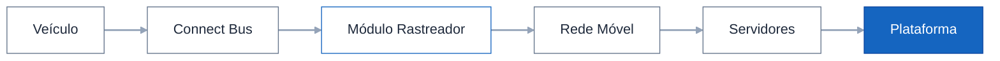

# Arquitetura do Sistema

A arquitetura da **Chiptronic Telematics** foi projetada para realizar a coleta, transmissão, processamento e visualização de dados de veículos em tempo real.

A solução integra dispositivos instalados no veículo com uma infraestrutura em nuvem e uma plataforma web, permitindo o monitoramento contínuo da frota e o acesso às informações operacionais por meio de uma interface centralizada.

---

# Visão Geral da Arquitetura

A solução é composta por quatro componentes principais que trabalham de forma integrada:

- Connect Bus
- Módulo Rastreador
- Câmera de Monitoramento do Motorista
- Plataforma Web

Cada componente desempenha uma função específica dentro do processo de aquisição e disponibilização das informações de telemetria.

---

# Componentes da Arquitetura

## Connect Bus

O Connect Bus é o dispositivo responsável pela comunicação com as redes eletrônicas do veículo.

Sua função é coletar informações operacionais geradas pelos módulos eletrônicos e disponibilizá-las ao Módulo Rastreador.

Entre os dados coletados estão:

- Velocidade do veículo
- Rotação do motor (RPM)
- Consumo de combustível
- Nível de combustível
- Temperatura do motor
- Posição da marcha
- Hodômetro
- Informações de diagnóstico do veículo

O Connect Bus atua como a principal fonte de dados de telemetria veicular.

---

## Módulo Rastreador

O Módulo Rastreador é responsável por centralizar as informações coletadas no veículo.

Ele reúne dados provenientes de diferentes fontes e realiza sua transmissão para os servidores da Chiptronic.

Suas principais responsabilidades incluem:

- Obter a localização do veículo por GPS;
- Receber os dados enviados pelo Connect Bus;
- Comunicar-se com a câmera de monitoramento do motorista;
- Transmitir todas as informações por meio da rede móvel.

O módulo funciona como o elo entre o veículo e a infraestrutura em nuvem.

---

## Câmera de Monitoramento do Motorista

A câmera é responsável pelo monitoramento do comportamento do motorista durante a operação do veículo.

Os eventos detectados podem ser utilizados para compor indicadores relacionados à segurança da condução.

Entre os eventos monitorados estão:

- Distração;
- Fadiga;
- Sonolência;
- Comportamentos considerados inseguros.

As ocorrências são associadas ao motorista e ficam disponíveis para consulta na plataforma.

---

## Infraestrutura em Nuvem

Após a transmissão pelo Módulo Rastreador, os dados são recebidos pelos servidores da Chiptronic.

A infraestrutura em nuvem é responsável por:

- Receber os dados enviados pelos dispositivos;
- Processar as informações recebidas;
- Armazenar o histórico de telemetria;
- Disponibilizar os dados para consulta na Plataforma Web.

> **Informação não disponível:** detalhes sobre tecnologias utilizadas, banco de dados, provedores de nuvem, protocolos de comunicação e arquitetura interna dos servidores.

---

## Plataforma Web

A Plataforma Web é a interface utilizada pelos usuários para acessar todas as informações processadas pelo sistema.

Por meio dela é possível:

- Monitorar veículos em tempo real;
- Consultar dados históricos;
- Visualizar indicadores operacionais;
- Acompanhar informações dos motoristas;
- Acessar alertas e relatórios;
- Consultar dados detalhados de telemetria.

A plataforma concentra todas as funcionalidades de gerenciamento da frota em um único ambiente.

---

# Comunicação entre os Componentes

O funcionamento da arquitetura ocorre de forma contínua.

1. O Connect Bus coleta dados diretamente das redes eletrônicas do veículo.
2. O Módulo Rastreador recebe essas informações juntamente com os dados de localização GPS.
3. A câmera envia os eventos de monitoramento do motorista ao Módulo Rastreador.
4. O Módulo Rastreador transmite todas as informações para os servidores da Chiptronic utilizando redes móveis.
5. Os servidores processam e armazenam os dados recebidos.
6. As informações ficam disponíveis para consulta na Plataforma Web.

Esse fluxo permite que os usuários acompanhem a operação da frota praticamente em tempo real.

---

# Benefícios da Arquitetura

A integração entre hardware, comunicação móvel, infraestrutura em nuvem e plataforma web proporciona diversos benefícios operacionais, incluindo:

- Monitoramento contínuo da frota;
- Centralização das informações em um único ambiente;
- Acompanhamento em tempo real da operação;
- Armazenamento de dados históricos;
- Suporte à análise de desempenho de veículos e motoristas.

---

# Próxima etapa

Após compreender a arquitetura da solução, recomenda-se a leitura da página **Fluxo de Dados**, que descreve como as informações percorrem todo o sistema, desde a coleta no veículo até sua visualização na Plataforma Web.

---

<a href="/introducao/visao-geral" class="doc-button">
&#8592; Visão Geral
</a>

<a href="/introducao/fluxo-dados" class="doc-button">
Fluxo de Dados 	&#8594;
</a>

