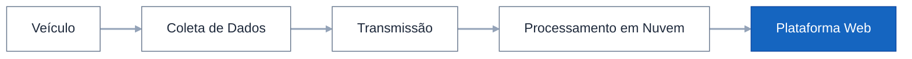

# Visão Geral

A **Chiptronic Telematics** é uma solução completa de monitoramento de frotas e inteligência veicular desenvolvida pela Chiptronic.

A plataforma integra dispositivos de hardware próprios, infraestrutura em nuvem e uma aplicação web para coletar, transmitir, processar e disponibilizar informações de telemetria em tempo real.

Seu objetivo é fornecer às empresas uma visão abrangente da operação de suas frotas, permitindo acompanhar o desempenho dos veículos, monitorar motoristas, aumentar a segurança operacional e apoiar a tomada de decisões com base em dados.

---

# Como a solução funciona

A solução é composta por dispositivos instalados no veículo que coletam informações operacionais e de localização.

Esses dados são enviados para os servidores da Chiptronic por meio de redes móveis, onde são processados e disponibilizados na Plataforma Web para consulta em tempo real e análise histórica.

O fluxo simplificado do sistema pode ser representado da seguinte forma:

---

# Principais Objetivos

A plataforma foi desenvolvida para auxiliar empresas na gestão de suas frotas por meio de informações precisas e atualizadas.

Entre seus principais objetivos estão:

- Monitorar veículos em tempo real;
- Acompanhar indicadores de desempenho;
- Melhorar a eficiência operacional;
- Reduzir o consumo de combustível;
- Aumentar a segurança da operação;
- Monitorar o comportamento dos motoristas;
- Disponibilizar informações históricas para análise.

---

# Componentes da Solução

A Chiptronic Telematics é composta por quatro componentes principais.

## Connect Bus

Dispositivo responsável pela coleta de informações diretamente das redes eletrônicas do veículo.

## Módulo Rastreador

Responsável por receber os dados do Connect Bus, obter a localização GPS, comunicar-se com a câmera de monitoramento e transmitir todas as informações para os servidores da Chiptronic.

## Câmera de Monitoramento

Realiza o monitoramento do comportamento do motorista, identificando eventos relacionados à segurança durante a condução.

## Plataforma Web

Interface utilizada pelos usuários para monitorar veículos, motoristas e indicadores operacionais.

---

# Principais Funcionalidades

A plataforma disponibiliza diversos recursos para acompanhamento da operação da frota.

Entre eles:

- Dashboard da frota;
- Rastreamento em tempo real;
- Monitoramento de veículos;
- Monitoramento de motoristas;
- Histórico de viagens;
- Indicadores Eco Driving;
- Alertas operacionais;
- Relatórios;
- Visualização de dados de telemetria.

---

# Público-alvo

A documentação da Chiptronic Telematics foi desenvolvida para atender diferentes perfis de usuários.

Entre eles:

- Gestores de frota;
- Operadores da plataforma;
- Revendedores;
- Equipes de suporte;
- Administradores do sistema;
- Equipes técnicas.

---

# Informações Importantes

Esta documentação descreve o funcionamento da plataforma com base nas informações atualmente disponíveis.

Quando algum detalhe técnico não estiver presente no material de origem, ele será identificado como:

> **Informação não disponível.**

---

<a href="/home" class="doc-button">
	&#8592; Início
</a>
  
<a href="/introducao/arquitetura" class="doc-button">
  Arquitetura do Sistema &#8594;
</a>

